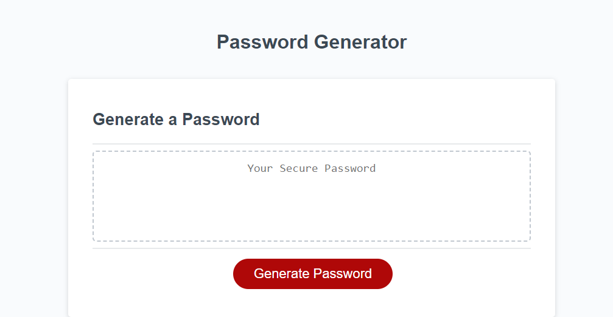

# Random Password Generator

## Description

This project is to create a random password, so that users can have neccessary account security. It solves this problem by being easy to navigate and, are able to use it repeadately.

## Installation

N/A

## Usage

Press the "Generate Password" button and the user will be prompted to give criteria of password length, if they want uppercase letters, lowercase letters, numbers, and/or special characters. The randomly generated password will be displayed where it says "Your Secure Password".

## Credits

N/A

## License

N/A